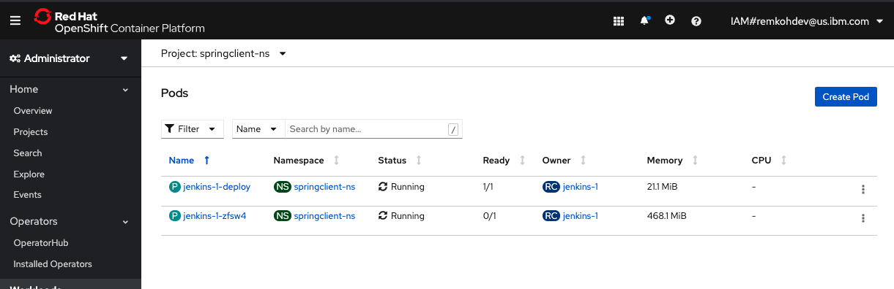
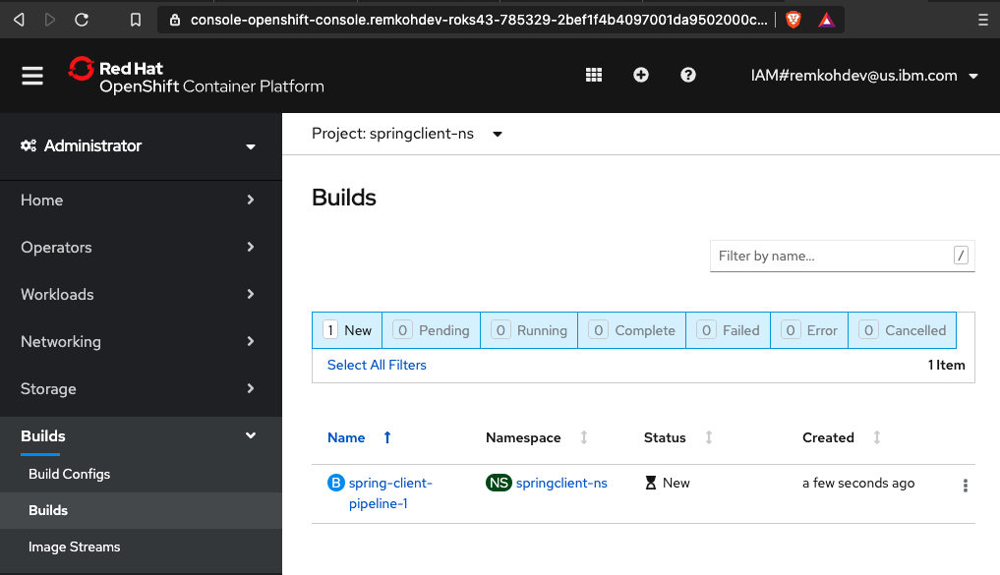
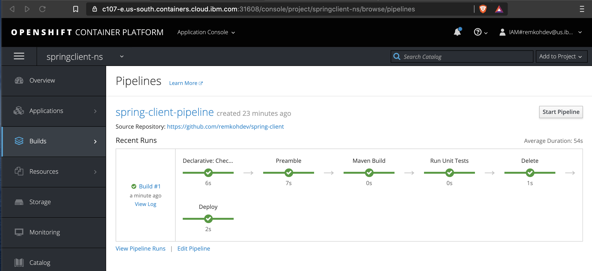

# Using a Pipeline Build Strategy on OpenShift 4.x

With the release of OpenShift Pipelines based on Tekton, the pipelines build strategy has been deprecated on OpenShift 4.x. Users should either use Jenkins files directly on Jenkins or use cloud-native CI/CD with Openshift Pipelines.

OpenShift Pipelines give you control over building, deploying, and promoting your applications on OpenShift. Using a combination of the Jenkins Pipeline Build Strategy, Jenkinsfiles, and the OpenShift Domain Specific Language (DSL) (provided by the OpenShift Jenkins Client Plug-in), you can create advanced build, test, deploy, and promote pipelines for any scenario.

The OpenShift Jenkins Client Plug-in must be installed on your Jenkins master. The OpenShift Jenkins Client Plug-in provides a fluent-styled DSL for communicating with the OpenShift API from within the Jenkins slaves. The OpenShift DSL is based on Groovy syntax and provides methods for controlling the lifecycle of your application such as create, build, deploy, and delete. This strategy defaults to using a jenkinsfile. The jenkinsfile is executed on the Jenkins slave pod.

This lab creates an OpenShift Pipeline to build the `springclient` application instead of a pure Jenkins Pipeline. The OpenShift Pipeline still uses the Jenkins Pipeline strategy but OpenShift will now create a Jenkins slave to execute the pipeline and managing the Pipeline is now done in OpenShift.

## Clean up Existing Deployment

1. Go to the Cloud Shell and make sure you are logged in to your cluster,
1. Delete the existing project,

    ```console
    oc delete project jenkins
    oc delete project springclient-ns
    ```

    outputs,

    ```console
    $ oc delete project jenkins
    project.project.openshift.io "jenkins" deleted
    $ oc delete project springclient-ns
    project.project.openshift.io "springclient-ns" deleted
    ```

1. Your existing Jenkins deployment should be deleted, as well as your springclient deployment.

## Deploy the Spring Client

1. From the cloud shell,
1. Create the project anew,

    ```console
    oc new-project springclient-ns
    ```

1. Create the BuildConfig declaration file using a Jenkins pipeline strategy, use your own forked repo instead of the one listed in the `spec.source.git.uri` attribute here, and set the `spec.strategy.jenkinsPipelineStrategy.env` environment vairables to match your cluster's LOGIN_URL and LOGIN_PORT found via the `Copy Login Command`,

    ```console
    echo 'kind: "BuildConfig"
    apiVersion: "v1"
    metadata:
      name: "spring-client-pipeline"
      namespace: springclient-ns
    spec:
      source:
        git:
          uri: "https://github.com/remkohdev/spring-client"
          ref: "master"
      strategy:
        jenkinsPipelineStrategy:
          jenkinsfilePath: Jenkinsfile-oc
          env:
          - name: "LOGIN_URL"
            value: "https://c103-e.us-south.containers.cloud.ibm.com"
          - name: "LOGIN_PORT"
            value: "32110"
          - name: "PROJECT"
            value: "springclient-ns"' > spring-client-pipeline.yaml 
    ```

1. A BuildConfig or build configuration describes a build definition and triggers for when a new build should be created. The Pipeline build strategy allows you to define a Jenkins pipeline for execution by the `Jenkins pipeline plugin`.

1. The first time a user defines a build configuration in a project using a Pipeline strategy, OpenShift Container Platform instantiates a Jenkins server to execute the pipeline.

1. To be sure, close any tabs open to the Jenkins instance.

1. Review the Jenkinsfile called `Jenkinsfile-oc` for the OpenShift Pipeline at [https://github.com/remkohdev/spring-client/Jenkinsfile-oc](https://github.com/remkohdev/spring-client/Jenkinsfile-oc). The pipeline is using the [Maven DSL](https://jenkinsci.github.io/job-dsl-plugin/#path/freeStyleJob-steps-maven) (Domain Specific Language) and the OpenShift DSL.

1. Create a Jenkins master,

    ```console
    oc new-app jenkins-ephemeral
    ```

    outputs,

    ```console
    $ oc new-app jenkins-ephemeral
    --> Deploying template "openshift/jenkins-ephemeral" to project springclient-ns

        Jenkins (Ephemeral)
        ---------
        Jenkins service, without persistent storage.
        
        WARNING: Any data stored will be lost upon pod destruction. Only use this template for testing.

        A Jenkins service has been created in your project.  Log into Jenkins with your OpenShift account.  The tutorial at https://github.com/openshift/origin/blob/master/examples/jenkins/README.md contains more information about using this template.

        * With parameters:
            * Jenkins Service Name=jenkins
            * Jenkins JNLP Service Name=jenkins-jnlp
            * Enable OAuth in Jenkins=true
            * Memory Limit=1Gi
            * Jenkins ImageStream Namespace=openshift
            * Disable memory intensive administrative monitors=false
            * Jenkins ImageStreamTag=jenkins:2
            * Allows use of Jenkins Update Center repository with invalid SSL certificate=false

    --> Creating resources ...
        route.route.openshift.io "jenkins" created
        deploymentconfig.apps.openshift.io "jenkins" created
        serviceaccount "jenkins" created
        rolebinding.authorization.openshift.io "jenkins_edit" created
        service "jenkins-jnlp" created
        service "jenkins" created
    --> Success
        Access your application via route 'jenkins-springclient-ns.remkohdev-roks43-785329-2bef1f4b4097001da9502000c44fc2b2-0000.sjc03.containers.appdomain.cloud' 
        Run 'oc status' to view your app.
    ```

1. Go to your OpenShift console, go to Workloads > Pods and in the project `springclient-ns`, view the status of your Jenkins instance,

    

1. From the console output or the OpenShift console > Networking > Routes, get the route to access the Jenkins instance, open the link to your Jenkins instance in a new tab,
1. Log in with OpenShift,
1. Authorize access and click `Allow selected permissions`,
1. Welcome to Jenkins!
1. Create the BuildConfig and the OpenShift Pipeline,

    ```console
    oc create -f spring-client-pipeline.yaml
    ```

    outputs,

    ```console
    $ oc create -f spring-client-pipeline.yaml
    buildconfig.build.openshift.io/spring-client-pipeline created
    ```

1. Go to `Builds` > `Build Configs`,

    

1. Start a build of the pipeline,

    ```console
    $ oc start-build spring-client-pipeline
    build.build.openshift.io/spring-client-pipeline-1 started
    ```

    

1. Go to `Builds` > `Builds`. Select the `springclient-ns` project from the `Project` dropdown. Once the Jenkins instance is created, the Jenkins instance will start the pipeline to create the `springclient` application.

1. A pipeline build was started,

    

1. The `View logs` will open the Jenkins instance,

## Resources

See: [OpenShift Build Strategies](https://docs.openshift.com/container-platform/4.5/builds/build-strategies.html#builds-strategy-pipeline-providing-jenkinsfile_build-strategies)
