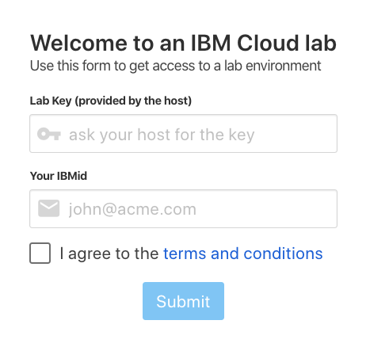
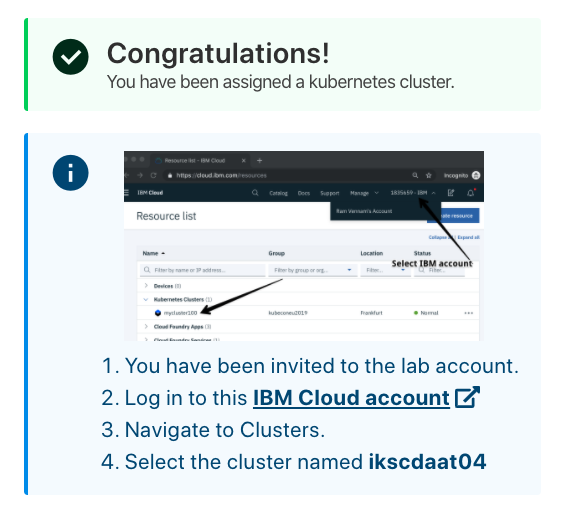
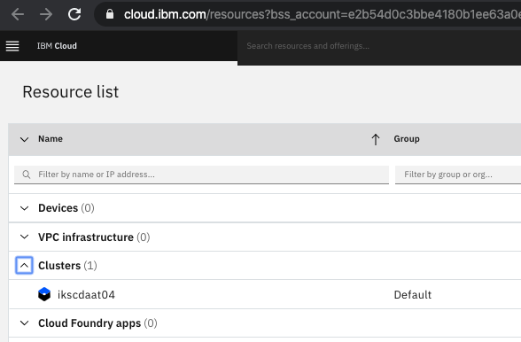
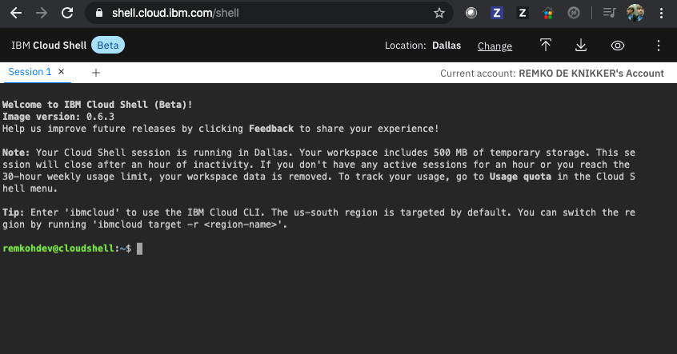

# Setup


## Kubernetes Cluster

For an IBM led workshop, you can use a temporary free cluster that was pre-created for the purpose of the workshop.

1. You need an IBM Cloud account to access your cluster,
1. If you do not have IBM Cloud account yet, register at https://cloud.ibm.com/registration, 
1. Open the URL that was provided to you by the instructor to access your cluster,

	

1. Log in to this IBM Cloud account using the workshop code and your IBM Cloud account IBM id,
1. Instructions will ask to `Log in to this IBM Cloud account`

	

1. Navigate to Clusters,
1. And select the cluster assigned to you... 

	

1. Details for your cluster will load,
1. Go to the `Access` menu item in the left navigation column,
1. Follow the instructions to access your cluster from the client,

	

2. If you need a cloudshell you can use https://shell.cloud.ibm.com/. It should be attached to your IBMid. It might take a few moments to create the instance and a new session,

	

1. You should now be read to start with [Lab 1](../lab-01/README.md),

<!-- 
## Red Hat OpenShift Kubernetes Service (ROKS)

TBD

## Try OpenShift Trial

### Install the oc cli

```
$ brew install openshift-cli
```

### Create an OpenShift Trial Cluster

Go to http://manage.openshift.com/,


Login to Red Hat account,


Enter your password and login,
Create a new OpenShift `OCP4` cluster,

Once your `OCP4` cluster is ready, click the `Open Web Console` button,


In the top right, click the drop down of your profile,
Click the `Copy Login Command` link,


## Play with K8s

Go to https://labs.play-with-k8s.com/

You can bootstrap a cluster as follows:

1. Initializes cluster master node:

	```
	kubeadm init --apiserver-advertise-address $(hostname -i)
	```

1. Initialize cluster networking:

	```
	kubectl apply -n kube-system -f "https://cloud.weave.works/k8s/net?k8s-version=$(kubectl version | base64 |tr -d '\n')"
	```

1. (Optional) Create an nginx deployment:

	```
	kubectl apply -f https://raw.githubusercontent.com/kubernetes/website/master/content/en/examples/application/nginx-app.yaml
	```

1. Get Pods

	```
	$ kubectl get pods
	```
-->