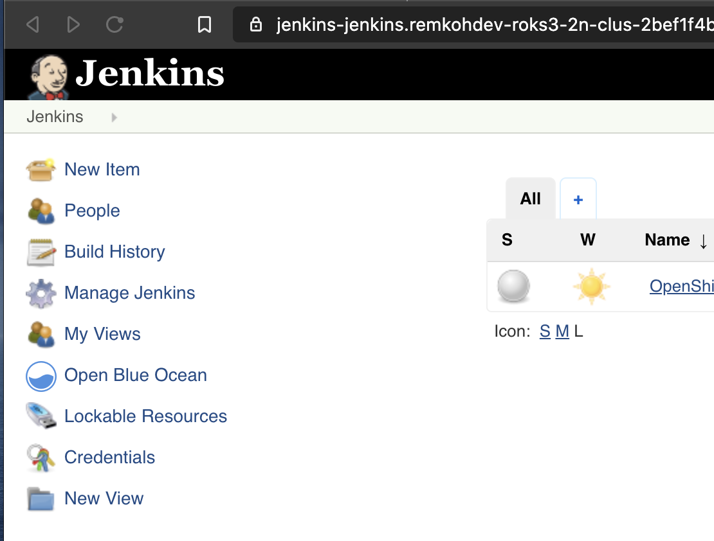
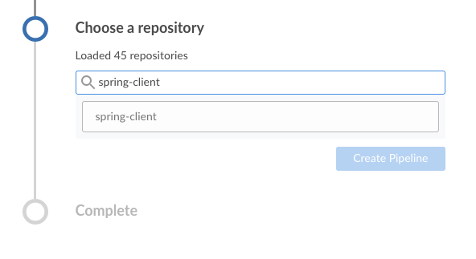
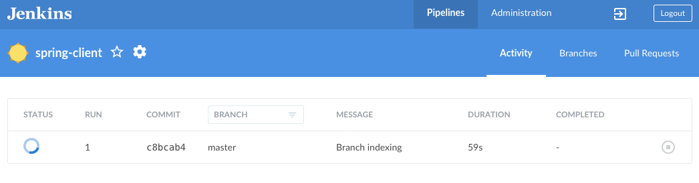
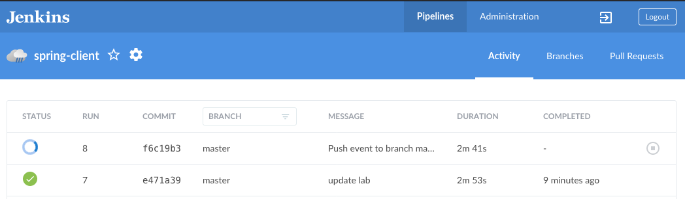

# Classic Pipeline with Jenkins (Ephemeral) on OpenShift 3

## Requirements

- An IBM Cloud account
- An OpenShift 3 cluster with a minimum of 3 worker nodes
- Access to an IBM Cloud shell at https://shell.cloud.ibm.com
- A Jenkins instance on OpenShift 3
- A Github fork of https://github.com/remkohdev/spring-client,
- Github personal access token


## Setup Jenkins (Ephemeral) on OpenShift 3

Go to [Setup Jenkins on OpenShift 3](SETUP.md) to complete the Jenkins setup and configuration on OpenShift 3.


## Fork the `spring-client` App in Github

To create a fork of the spring-client repository:

1. Go to https://github.com/remkohdev/spring-client,
1. Cick the `Fork` button in the to right to create a fork in your own GitHub organization, e.g. `https://github.com/<username>/spring-client`
1. Review the Jenkinsfile that is included in the Spring Client repository,
1. Edit the Jenkinsfile,
1. In the Login stage, Change the URL and the port to match your login command,


## Create a Github Personal Access Token

1. Login to your Github account at https://github.com/
1. Go to https://github.com/settings/tokens
1. Click `Generate new token`
1. Under `Note` add `github-access-token-for-jenkins-on-openshift`,
1. Select the scopes for `repo`, `read:repo_hook`, and `user`,
1. Click `Generate token`,
1. Copy the token and save it, you need it to create the Jenkins pipeline from the Github source,


## Configure Jenkins Access to OpenShift

1. Go to the OpenShift web console,
1. From the logged in user profile dropdown, click the Copy Login Command. The command should look like,

    ```
    oc login https://<your-openshift-url>:<your-openshift-port> --token=<your-openshift-api-token>
    ```

1. Copy the OpenShift API token value, e.g. aaHYcMwUyyusfNaS45aAiQer_Kas1YUa45YTA2AxsNI,

1. Go to the Jenkins dashboard,
1. Click Credentials, or
1. Go to Jenkins > Manage Jenkins > Configure Credentials

    

1. The Jenkinsfile expects an OpenShift API token credential to be available named `openshift-login-api-token`,
1. Go to Credentials > System,

    

1. In the System view, select the dropdown for Global credentials (unrestricted),

    

1. From the drowdown, click `Add credentials`,
1. For Kind select `Username with password`,
1. For Username enter `token`,
1. For Password paste the OpenShift API token from the OpenShift web console login command,
1. For ID enter `openshift-login-api-token`, which is the ID that the Jenkinsfile will look for,
1. For Description enter `openshift-login-api-token`,
1. Click Save,

    


## Create a Jenkins Pipeline

1. Open the OpenShift web console,
1. From the top navigation dropdown, go to the `Cluster Console`,
1. Go to Administration > Projects,
1. Filter projects by `springclient-ns`,
1. If there is no such project, click `Create Project` to create it,
1. The Jenkinsfile of the spring-client application defines a stage to delete and create the `springclient-ns` project. The delete step causes an error when the project it tries to delete is missing,
1. Make sure a project `springclient-ns` exists in OpenShift,
1. if no `springclient-ns` project exists, create it from the cloud shell, 

    ```
    $ oc new-project springclient-ns
    ```

1. Go to the `Application Console`, and go to the project `jenkins`,
1. Click the Route for External Traffic to open the Jenkins instance,
1. Click `Log in with OpenShift`,
1. In the Jenkins Dashboard, click `Open Blue Ocean` to open the Blue Ocean editor. 

    

1. If the Welcome to Jenkins popup window shows, click the `Create a new Pipeline` button, 

    

1. Otherwise, click the `New Pipeline` button in the Pipelines window. This will create a new Multibranch Pipeline,

    

1. Select the GitHub option,

    

1. In the Connect to GitHub section, paste the personal access token you created in your Github account,

    

1. Click Connect,
1. Select the organization to where you forked the `spring-client` repository,
1. Search for and select the `spring-client` repo,

    

1. Click Create Pipeline,
1. When the pipeline creation is completed, a build is triggered automatically,

    

1. You should see a successful build of the pipeline,
1. If an error occurs, you can debug the pipeline by unfolding the red cross indicating on the stage, which indicates the pipeline failed in that stage, 
1. Unfold the step in the stage, to see the log output,

    

    

1. Any update to the Github repository, e.g. a push to update the Jenkinsfile, source code of the Spring Boot application, or the README.md file, will automatically trigger a new build of the pipeline,

    

1. If you're interested, review the pipeline settings:
    1. Click the Configure option,
    1. Review the settings,
1. From the cloud shell, make sure you're logged in to the OpenShift console,
1. Use the project `oc project springclient-ns`,
1. Get the route and test the deployment, 

    ```
    $ ROUTE="$(oc get route springclient -o json | jq -r '.spec .host')"
    $ curl -X GET http://$ROUTE/api/hello?name=you
    { "message" : "Hello you" }
    ```