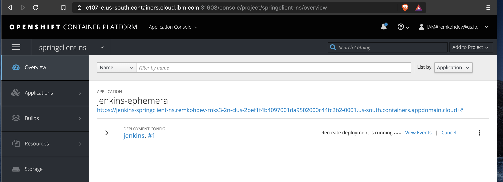
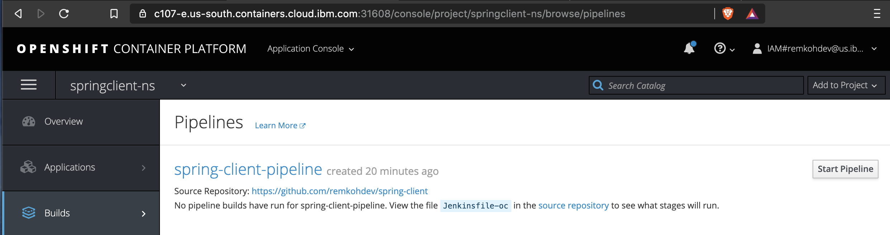
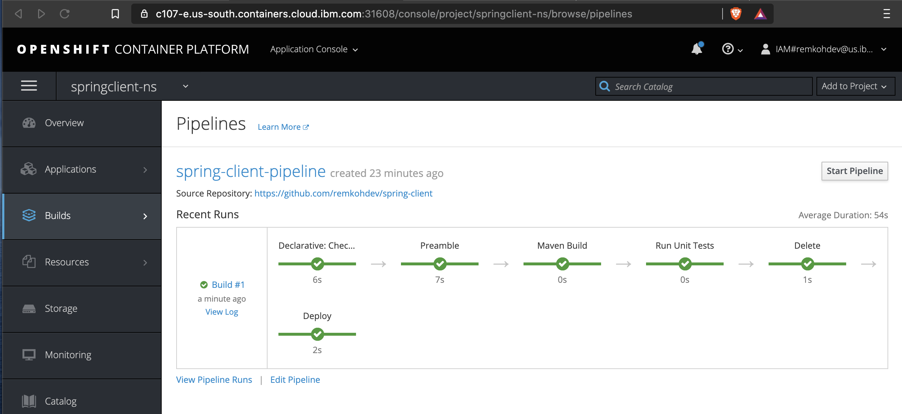
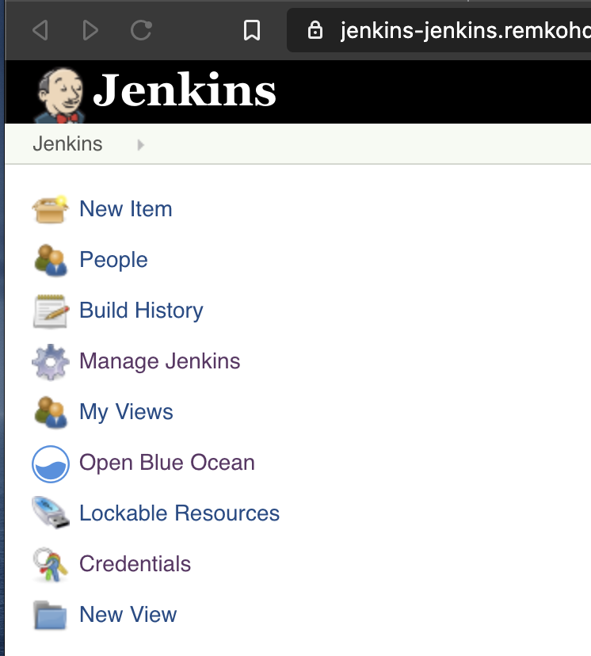
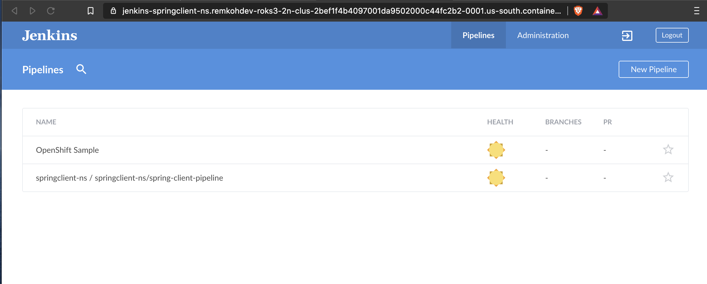
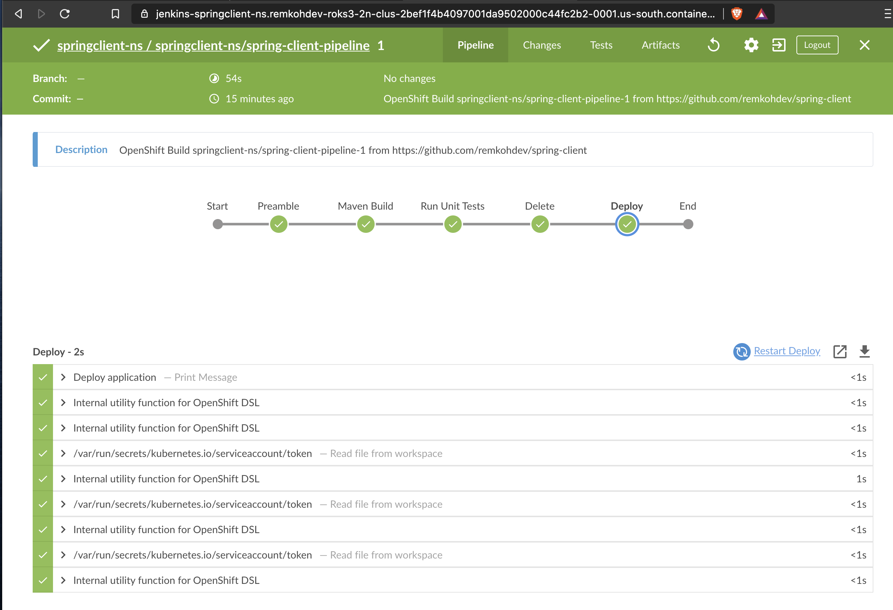

# Lab02 - Create an OpenShift Pipeline with Jenkins Pipeline Build Strategy on OpenShift 3

OpenShift Pipelines give you control over building, deploying, and promoting your applications on OpenShift. Using a combination of the Jenkins Pipeline Build Strategy, Jenkinsfiles, and the OpenShift Domain Specific Language (DSL) (provided by the OpenShift Jenkins Client Plug-in), you can create advanced build, test, deploy, and promote pipelines for any scenario. 

The OpenShift Jenkins Client Plug-in must be installed on your Jenkins master. The OpenShift Jenkins Client Plug-in provides a fluent-styled DSL for communicating with the OpenShift API from within the Jenkins slaves. The OpenShift DSL is based on Groovy syntax and provides methods for controlling the lifecycle of your application such as create, build, deploy, and delete. This strategy defaults to using a jenkinsfile. The jenkinsfile is executed on the Jenkins slave pod.

This lab creates an OpenShift Pipeline to build the `springclient` application instead of a pure Jenkins Pipeline. The OpenShift Pipeline still uses the Jenkins Pipeline strategy but OpenShift will now create a Jenkins slave to execute the pipeline and managing the Pipeline is now done in OpenShift.

## Clean up Existing Deployment

1. Go to the Cloud Shell and make sure you are logged in to your cluster,
1. Delete the existing project,

    ```
    $ oc delete project jenkins
    $ oc delete project springclient-ns
    project.project.openshift.io "springclient-ns" deleted
    ```

1. Your existing Jenkins deployment should be deleted, as well as your springclient deployment.

## Deploy the Spring Client

1. From the cloud shell,
1. Create the project anew,

    ```
    $ oc new-project springclient-ns
    ```

1. Create the BuildConfig declaration file using a Jenkins pipeline strategy, use your own forked repo instead of the one listed in the `spec.source.git.uri` attribute here, and set the `spec.strategy.jenkinsPipelineStrategy.env` environment vairables to match your cluster's LOGIN_URL and LOGIN_PORT found via the `Copy Login Command`,
```
$ echo 'kind: "BuildConfig"
apiVersion: "v1"
metadata:
  name: "spring-client-pipeline"
  namespace: springclient-ns
spec:
  source:
    git:
      uri: "https://github.com/remkohdev/spring-client"
      ref: "master"
  strategy:
    jenkinsPipelineStrategy:
      jenkinsfilePath: Jenkinsfile-oc
      env:
        - name: "LOGIN_URL"
          value: "https://c100-e.us-south.containers.cloud.ibm.com"
        - name: "LOGIN_PORT"
          value: "30645"
        - name: "PROJECT"
          value: "springclient-ns"' > spring-client-pipeline.yaml 
```

1. A BuildConfig or build configuration describes a build definition and triggers for when a new build should be created. The Pipeline build strategy allows you to define a Jenkins pipeline for execution by the `Jenkins pipeline plugin`. 

1. The first time a user defines a build configuration in a project using a Pipeline strategy, OpenShift Container Platform instantiates a Jenkins server to execute the pipeline. OpenShift Container Platform looks for a template named `jenkins-ephemeral` in the openshift namespace and instantiates it within the user’s project. 

1. To be sure, close any tabs open to the Jenkins instance. 

1. Review the Jenkinsfile called `Jenkinsfile-oc` for the OpenShift Pipeline at https://github.com/remkohdev/spring-client/Jenkinsfile-oc. The pipeline is using the [Maven DSL](https://jenkinsci.github.io/job-dsl-plugin/#path/freeStyleJob-steps-maven) (Domain Specific Language) and the OpenShift DSL.

1. Create the BuildConfig and the OpenShift Pipeline,

    ```
    $ oc create -f spring-client-pipeline.yaml
    buildconfig.build.openshift.io/spring-client-pipeline created
    ```

1. Go to the `Application Console`,
1. Go to the `springclient-ns` project,
1. Go to the Overview,

    

1. A Jenkins instance was created in the new project namespace,
1. Go to Builds > Pipelines
1. Click `Start Pipeline`,

    

1. Or from the cloud shell start a build of the pipeline,

    ```
    $ oc start-build spring-client-pipeline
    build.build.openshift.io/spring-client-pipeline-1 started
    ```

1. Go to your OpenShift instance and go to the Application Console. Open the `springclient-ns` project. OpenShift should have created a Jenkins instance. Once the Jenkins instance is created, the Jenkins instance will start the pipeline to create the `springclient` application.

1. A pipeline build was started,

    

1. To review the pipeline in the Jenkins Dashboard, go to Overview,

    

1. Click the Route for the new `jenkins-ephemeral` instance (make sure you are not using the old Jenkins instance in the `jenkins` project)

    

1. Click `Log in with OpenShift`,

    

1. Click the `Open Blue Ocean` link,

    

1. The `Open Blue Ocean` dashboard lists the new pipeline,

    

1. Click on the `springclient-ns/springclient-ns/spring-client-pipeline` pipeline,
1. The builds for the pipeline are listed,

    

1. Click on build number 1,

    


## Resources

See: https://docs.openshift.com/container-platform/3.11/dev_guide/dev_tutorials/openshift_pipeline.html